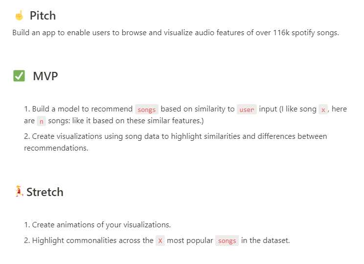

# Spotify Song Suggester

## Build an app to enable users to uviualize audio features of over 116K spotify songs.

Check indeed! We are using the [Spotify Dataset 1921-2020](https://www.kaggle.com/yamaerenay/spotify-dataset-19212020-160k-tracks?select=data_by_genres.csv) which contains the audio features of 160,000+ songs released between 1921 and 2020. What's wrong with 2020...Don't get me started.

This data surpasses the requirements for 116,000+ so let's get on with it.

## File: apotify_ipynb

This file is optimized for Google Colab.  It is highly recommended to open Google Colab and upload this file should you need to run it.  This file creates DataFrames from the csv files from the Kaggle website.  Some of the tasks it accomplishes are:
- Allows some simple data exploration
- Adds one Japanese song to the database
- Adds one column combining name and artist 
- Vectorizes the new column for use with NLP
- Breaks the vectorized DataFrame into smaller files
- It fits a KNN model and has a cell for testing.

If you only need to fit the model and test, then the file spotify_ii.ipynb is more suited for your purposes.

## File: spotify_ii.ipynb

This file is also optimized for Google Colab.  It is highly recommended to open Google Colab and upload this file to run the code.

Initially DataFrames are created from the small vectorized csv files then combined together.  This was necessary to facillitate uploading to GitHub.  The size of the csv in its original form exceeded GitHub's limits.

This file is all about tweaking the model for optimization and testing.  

